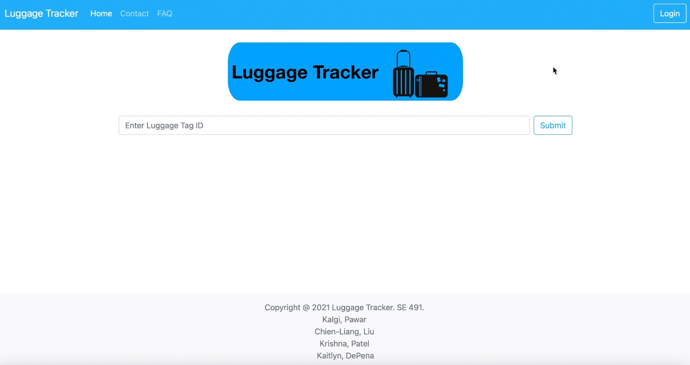
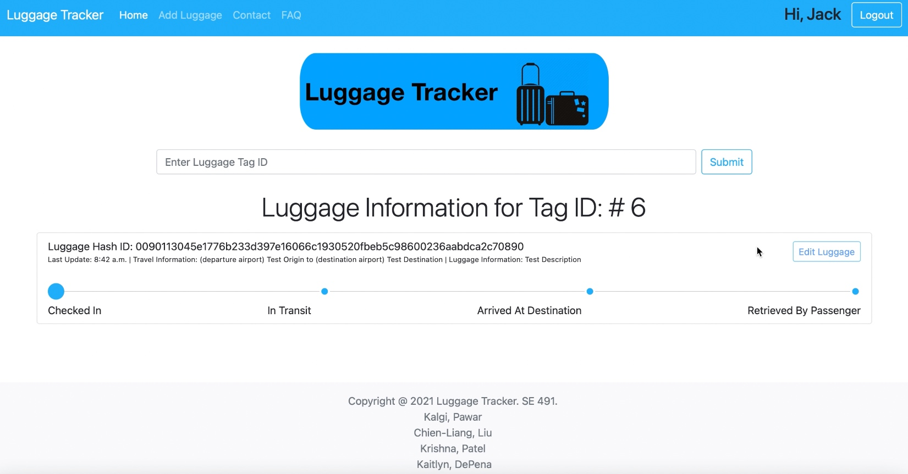
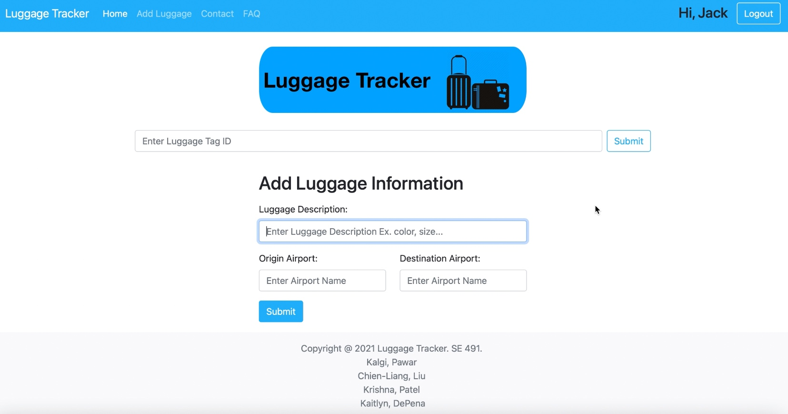
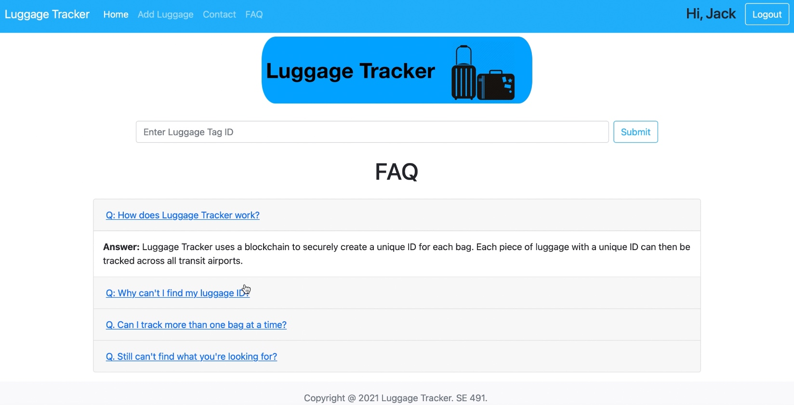
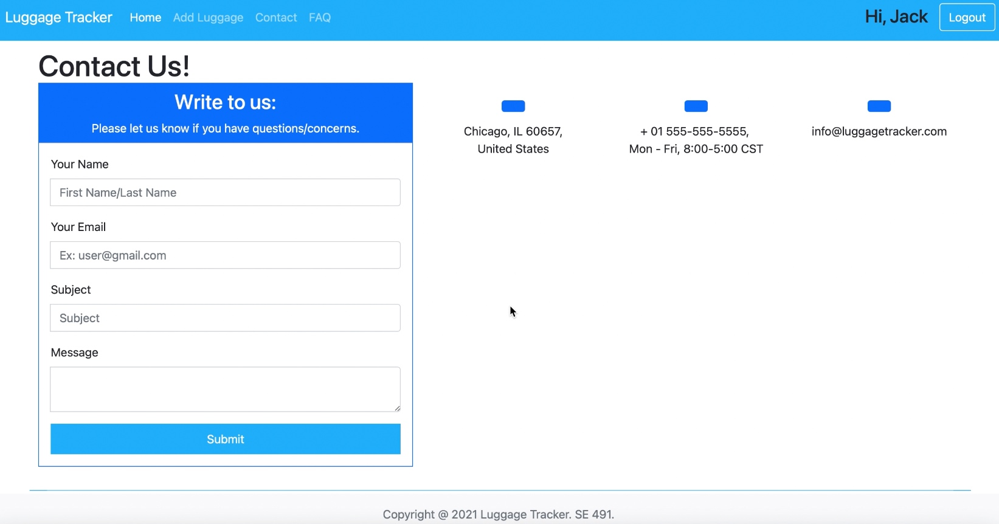

# LuggageTracker-Blockchain-Application

Prototype of Luggage Tracking website application built using Django Framework in utilizing blockchain system to store luggage transactions between destinations and airports. 
The website allows passengers to track their luggage location and allows staffs to login and add luggages upon passenger checkin. 
The website application is built using Django Framework and utilizing CI/CD from Heroku platform. 

 
-----**Install virtual environment & Django Framework (MAC)**-----

-Need to install Django environment and virtual environment in order to run project

-Install via "HomeBrew" command --> ruby -e "$(curl -fsSL https://raw.githubusercontent.com/Homebrew/install/master/install)"

-Install pip manager for software packages command --> curl https://bootstrap.pypa.io/get-pip.py -o get-pip.py 

-Execute download command --> python3 get-pip.py 

-Checking version pip - -version (check pip version)  or pip3  - -version

-Install virtual environment command --> pip install virtualenv then command --> pip install virtualenvwrapper 

-To activate the virtual environment to run the Django project in command --> source env/bin/activate 

-To deactivate the environment in command --> deactivate 

-Installing Django into virtual environment in command --> pip install Django (NOTE: the virtual environment must be active) 

-Check Django version in command -->django-admin - -version

 
-----**Run Project**-----

-To run the project, the virtual environment must be active, in command --> python3 manage.py runserver (copy the http link on to a browser) 

 
-----**Web Application Features**-----

-Airline/Staff user login and logout 

-Search for luggage based on given luggage tag ID (homepage) 
 

-Luggage information display based on search and also displays luggage Hash ID for demostration that luggage data are saved and appended into a blockchain. 

-Add luggage to database 

-FAQ page 

-Contact Us page

